<div align="center">

# 👋 Muhammad Ahsan Shaaf

### Senior Android & iOS Developer • Mobile App Architect • App Store & Play Store Manager

**I build, launch, monetize, and manage production-ready mobile apps for startups, founders, businesses, and app publishers.**

<br/>

<p>
  <a href="mailto:ahsanshaaf@gmail.com">
    
  </a>
  <a href="https://www.linkedin.com/in/iamahsanshaaf/">
    
  </a>
  <a href="https://x.com/iamAhsanShaaf">
    
  </a>
  <a href="https://github.com/iamahsanshaaf">
    
  </a>
</p>

<p>
  
  
  
  
  
  
  
</p>

</div>

---

## 🚀 About Me

I am a **Senior Android & iOS Developer** and founder of **Intuitex AI Solutions**, focused on building complete mobile products from idea to launch.

I work across the full app lifecycle:

- Product planning and feature structure
- Native Android development
- Native iOS development
- UI modernization and design system implementation
- Firebase, APIs, AI integrations, ads, subscriptions, and analytics
- Google Play Console and App Store Connect deployment
- Store listing preparation, monetization setup, release management, and post-launch improvements

I have developed and contributed to apps reaching **10M+ installs on Google Play**, including large-scale translator, AI keyboard, AI utility, photo enhancer, homework solver, AR drawing, VPN, productivity, scanner, and mobile utility apps.

> **My focus:** Build mobile apps that are clean, scalable, monetized, store-ready, and prepared for real users.

---

## 💼 What I Can Manage End-to-End

<table>
<tr>
<td width="50%">

### 📱 Mobile App Development

- Android apps with Kotlin and Jetpack Compose
- iOS apps with Swift and SwiftUI
- Clean Architecture, MVVM, MVI
- Scalable feature modules
- Modern UI components
- API and Firebase integration
- Local database and offline workflows

</td>
<td width="50%">

### 🚀 Store Launch & App Management

- Google Play Console setup
- App Store Connect setup
- App metadata and compliance support
- Internal testing and release tracks
- Production release preparation
- Version updates and rollout management
- Privacy, permissions, and policy alignment

</td>
</tr>

<tr>
<td width="50%">

### 💰 Monetization

- AdMob app open ads
- Native ads
- Interstitial ads
- Rewarded ads
- Remote Config ad control
- StoreKit in-app purchases
- Auto-renewable subscriptions
- Paywall implementation

</td>
<td width="50%">

### 🤖 AI & Firebase Apps

- OpenAI / Gemini API integration
- AI writer, AI chat, AI dictionary tools
- AI keyboard and assistant workflows
- Firebase Auth, Firestore, Crashlytics
- Analytics event tracking
- FCM notifications
- Remote Config experiments

</td>
</tr>
</table>

---

## 🧠 Core Tech Stack

### Android

<p>
  
  
  
  
  
  
</p>

- Kotlin, Java, Jetpack Compose, XML
- MVVM, MVI, Clean Architecture
- Room, SQLite, DataStore
- Retrofit, OkHttp, Ktor
- Coroutines, Flow, StateFlow
- Hilt, Dagger
- WorkManager
- Firebase, AdMob, Billing
- Google Play Console deployment

### iOS

<p>
  
  
  
  
</p>

- Swift, SwiftUI, UIKit when required
- MVVM, MVI, Clean Architecture
- SwiftData, CoreData
- StoreKit, subscriptions, IAP
- Async/Await, Combine
- URLSession
- Apple Vision / OCR
- App Store Connect deployment

### Backend, Analytics & Monetization

<p>
  
  
  
  
</p>

- Firebase Auth, Firestore, Realtime Database, Storage
- Firebase Crashlytics, Analytics, Remote Config, FCM
- AdMob native, interstitial, rewarded, app open ads
- StoreKit, IAP, subscriptions, paywalls
- OpenAI and Gemini integrations
- REST APIs and JSON-driven content systems

---

## 📊 Experience Highlights

| Area | Experience |
|---|---|
| High-scale Android apps | Developed and contributed to apps reaching **10M+ installs** |
| iOS app portfolios | Managed multiple App Store developer portfolios |
| App monetization | AdMob, IAP, subscriptions, paywalls, remote config |
| Store deployment | App Store Connect and Google Play Console |
| AI apps | AI writer, AI keyboard, AI dictionary, AI assistant, AI utilities |
| Architecture | Clean Architecture, MVVM, MVI, modular project structure |
| Product categories | AI, productivity, scanner, maps, GPS, VPN, utilities, lifestyle |

---

## 🤖 Android App Portfolio & Google Play Experience

I have worked on and contributed to multiple Android apps across AI, translation, productivity, camera, utility, VPN, and creative categories.

| App / Category | Google Play Link | Work Focus |
|---|---|---|
| Speak & Translate / Voice Translator | [View on Google Play](https://play.google.com/store/apps/details?id=com.speaktranslate.englishalllanguaguestranslator.ivoicetranslation) | Voice translation, language UX, performance, monetization, release support |
| AI Keyboard / AI Assistant / Art Generator | [View on Google Play](https://play.google.com/store/apps/details?id=aichatbot.keyboard.translate.aiask.artgenerator) | AI flows, keyboard UX, API integration, ads, Firebase |
| AI Photo Enhancer / Unblur Editor | [View on Google Play](https://play.google.com/store/apps/details?id=com.dw.aiphotoenhancer.unblur.editor) | Photo utility UX, AI-style editing flows, monetization |
| AI Homework Solver | [View on Google Play](https://play.google.com/store/apps/details?id=com.aiassistant.homeworksolver) | AI assistant flows, study tools, API-based experiences |
| AR Drawing / AR Sketch / Trace Anime | [View on Google Play](https://play.google.com/store/apps/details?id=com.ardrawing.arsketch.paint.traceanime) | Camera utility, drawing workflows, creative app UX |
| VPN App | [View on Google Play](https://play.google.com/store/apps/details?id=com.joltapps.vpn) | Utility app UX, subscription/monetization, release support |

> Some high-scale Android apps were built for companies and clients. Detailed proof, Play Console screenshots, and role details can be shared privately when required.

---

## 🍎 iOS App Store Portfolios Managed

I manage and work across multiple iOS App Store developer accounts and app portfolios.

### Ikhlaq Ahmed — iOS Portfolio

**Developer Account:**  
https://apps.apple.com/id/developer/ikhlaq-ahmed/id1777750146

| App Category | Example Apps |
|---|---|
| Gold / Metal Utilities | Gold Scanner & Age Estimator, Metal Detector & Gold Scanner, Gold Detector & Gold Scanner |
| Navigation / Maps | Live Earth Map & Satellite, Satellite Finder & Street View, GPS Camera Map & Geotag |
| Scanner / Image Tools | Signature Maker, Image Search, Photo Recovery, Stamp Maker |
| Fun / Creative | Face Warp Photo & Video Fun |

### Shahida Parveen — iOS Portfolio

**Developer Account:**  
https://apps.apple.com/id/developer/shahida-parveen/id1851386391

| App Category | Example Apps |
|---|---|
| Lifestyle | Pregnancy Tracker Journal |
| Gold / Metal Utilities | Metal Detector & Rock ID, Gold Detector - Metal Scanner |
| Navigation / GPS | Satellite Finder - GPS Tracker, Live Earth Map & Navigation |
| Scanner / Tools | Object Detector & DocScan, Stamp Maker & Signature Maker |
| Construction Utility | Draw Floor Plans |

### Muhammad Ahsan Shaaf — iOS Portfolio

**Developer Account:**  
https://apps.apple.com/id/developer/muhammad-ahsan-shaaf/id1844917800

| App | Focus |
|---|---|
| Gramlyse: AI Writer & Essay | AI writing, grammar tools, essay workflows, StoreKit subscriptions, App Store launch |

---

## 🏗️ Architecture Style

I build apps with separation of concerns, reusable components, scalable state management, and clean feature boundaries.

### Android Project Structure

```text
app/
 ├── core/
 │   ├── designsystem/
 │   ├── navigation/
 │   ├── analytics/
 │   ├── ads/
 │   ├── billing/
 │   └── utils/
 ├── data/
 │   ├── local/
 │   ├── remote/
 │   ├── repository/
 │   └── mapper/
 ├── domain/
 │   ├── model/
 │   ├── repository/
 │   └── usecase/
 └── presentation/
     ├── screen/
     ├── component/
     ├── state/
     └── viewmodel/
```

### iOS Project Structure

```text
App/
 ├── Core/
 │   ├── Theme/
 │   ├── Navigation/
 │   ├── Analytics/
 │   ├── Ads/
 │   ├── Purchases/
 │   └── Utilities/
 ├── Data/
 │   ├── Local/
 │   ├── Remote/
 │   └── Repository/
 ├── Domain/
 │   ├── Models/
 │   ├── UseCases/
 │   └── Contracts/
 └── Presentation/
     ├── Screens/
     ├── Components/
     ├── ViewModels/
     └── State/
```

---

## 🔄 My App Delivery Workflow

```mermaid
flowchart LR
    A[Idea / Requirements] --> B[Feature Scope]
    B --> C[UI / UX Structure]
    C --> D[Architecture Setup]
    D --> E[Development]
    E --> F[Firebase / APIs / AI]
    F --> G[Ads / IAP / Subscriptions]
    G --> H[Testing]
    H --> I[Store Listing]
    I --> J[App Review / Release]
    J --> K[Analytics / Improvements]
```



---

## 💼 Services I Offer

<details open>
<summary><b>📱 Android App Development</b></summary>

- Kotlin and Jetpack Compose apps
- Clean Architecture, MVVM, MVI
- Firebase, APIs, Room, Retrofit
- AdMob ads and Play Billing
- Google Play Console release support
- Existing app redesign and bug fixing

</details>

<details open>
<summary><b>🍎 iOS App Development</b></summary>

- Swift and SwiftUI apps
- StoreKit IAP and subscriptions
- SwiftData / CoreData integration
- Firebase and API integration
- App Store Connect deployment
- App redesign and production polish

</details>

<details open>
<summary><b>🤖 AI Mobile App Development</b></summary>

- AI writer apps
- AI chat apps
- AI keyboard apps
- AI dictionary and productivity tools
- OpenAI / Gemini integration
- Prompt-based mobile workflows

</details>

<details open>
<summary><b>💰 App Monetization & Store Management</b></summary>

- AdMob setup and ad placement strategy
- Remote Config monetization control
- In-app purchases
- Auto-renewable subscriptions
- Paywalls
- App Store and Play Store launch support
- Store metadata and compliance preparation

</details>

---

## 📌 App Categories I Have Worked On

<table>
<tr>
<td>AI Writing Apps</td>
<td>AI Keyboard Apps</td>
<td>Voice Translator Apps</td>
</tr>
<tr>
<td>AI Homework Solver Apps</td>
<td>AI Photo Enhancer Apps</td>
<td>VPN Utility Apps</td>
</tr>
<tr>
<td>Gold Scanner Apps</td>
<td>Metal Detector Apps</td>
<td>Live Earth Map Apps</td>
</tr>
<tr>
<td>GPS Navigation Apps</td>
<td>Satellite Finder Apps</td>
<td>Scanner / OCR Apps</td>
</tr>
<tr>
<td>Pregnancy Tracker Apps</td>
<td>Signature Maker Apps</td>
<td>Floor Plan Apps</td>
</tr>
</table>

---

## 🧪 Production Quality Checklist

When I build or manage an app, I focus on:

- Clean and maintainable code
- Reusable UI components
- Scalable architecture
- Proper state management
- Loading, empty, and error states
- Firebase Analytics and Crashlytics
- AdMob and IAP safety
- Store-compliant permission usage
- Smooth onboarding and paywall flows
- App Store and Play Store release readiness
- Post-launch monitoring and improvement

---

## 📂 Recommended Public Repositories

I am organizing my GitHub around portfolio-ready repositories that show real production skills.

| Repository Idea | Purpose |
|---|---|
| Jetpack Compose MVI Starter | Android clean architecture sample |
| SwiftUI MVI Starter | iOS clean architecture sample |
| Firebase Auth + Firestore Demo | Backend integration proof |
| AI Chat Mobile Demo | AI API integration proof |
| AdMob + IAP Monetization Demo | Monetization setup proof |
| SwiftUI Paywall Template | StoreKit subscription proof |
| Mobile Design System Components | UI component system proof |

---

## 📈 GitHub Activity

<div align="center">


</div>

> If any GitHub stats image fails to load, the profile content still remains fully readable because the README does not depend on external hero images.

---

## 🌍 Availability

I am open to:

- Freelance mobile app projects
- Android app development
- iOS app development
- AI mobile app development
- Startup MVPs
- Full app development from scratch
- App redesign projects
- App monetization setup
- Firebase and API integration
- App Store / Play Store launch support
- Long-term remote collaboration

---

## 📫 Contact

<p>
  <a href="mailto:ahsanshaaf@gmail.com">
    
  </a>
  <a href="https://www.linkedin.com/in/iamahsanshaaf/">
    
  </a>
  <a href="https://x.com/iamAhsanShaaf">
    
  </a>
</p>

**Email:** ahsanshaaf@gmail.com  
**Location:** Pakistan  
**Availability:** Remote freelance, contract, and long-term mobile app projects  

---

<div align="center">

## ⭐ Let’s Build Your Next Mobile App

**From idea → UI → development → monetization → App Store / Play Store launch**

If you are a founder, startup, business owner, or app publisher looking to build or improve a mobile app, I can help you turn your idea into a real product.

</div>
