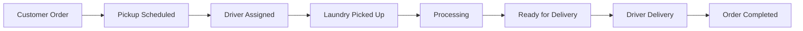

 

 
 

---

<table>
<tr>
<td width="55%" valign="top">

## 🚀 About Me

I am **Muhammad Ahsan Shaaf**, a **Senior Android & iOS Developer** and founder of **Intuitex AI Solutions**.

I build complete mobile products for **startups, founders, businesses, product teams, and app publishers** — from idea and UI collaboration to development, APIs, monetization, deployment, and post-launch improvements.

My work covers:

- Product planning and feature breakdown
- Figma/UI collaboration with designers
- Native Android development
- Native iOS development
- API integration and backend collaboration
- Firebase, analytics, crash tracking, and notifications
- AdMob, IAP, subscriptions, and paywalls
- App Store Connect and Google Play Console release management
- Store-ready polishing, testing, updates, and optimization

</td>
<td width="45%" valign="top">

## 🎯 My Positioning

I do not only build screens.

I build complete apps with:

- Clean user experience
- Stable architecture
- Scalable API integration
- Monetization readiness
- Store compliance awareness
- Real release management
- Long-term maintainability

> My goal is to build mobile products ready for real users, real growth, and real business outcomes.

</td>
</tr>
</table>

---

## 🧼 Cleandense — Main Featured Product

**Cleandense** is a complete laundry management software ecosystem designed to manage the full laundry business workflow from customer order placement to pickup, washing, delivery, driver operations, and admin control.

It is not just an app. It is a complete product ecosystem:

<table>
<tr>
<td width="25%" align="center"><b>Customer App</b> Order placement Pickup scheduling Order tracking Order history</td>
<td width="25%" align="center"><b>Driver App</b> Assigned jobs Pickup confirmation Delivery confirmation Status updates</td>
<td width="25%" align="center"><b>Admin Dashboard</b> Order monitoring Customer control Driver control Service management</td>
<td width="25%" align="center"><b>Backend APIs</b> Order lifecycle User data flow Driver flow Business rules</td>
</tr>
</table>

### My Role in Cleandense

| Area | Contribution |
|---|---|
| Product Workflow | Converted laundry business operations into mobile user journeys |
| Android App | Developed and managed Android customer and workflow features |
| iOS App | Developed and managed iOS customer and workflow features |
| Driver Flow | Worked on Uber/Careem-style pickup and delivery job workflows |
| UI/UX Collaboration | Coordinated with UI/UX team for Figma designs and implementation |
| Backend Collaboration | Coordinated with backend developer for APIs, data flow, and feature behavior |
| Testing & Improvements | Tested flows, fixed bugs, improved app quality and user experience |

---

## 🛠️ What I Can Build & Manage

<b>📱 Android App Development</b>

- Kotlin and Jetpack Compose apps
- Custom Android apps
- API-based Android apps
- Firebase-powered apps
- AdMob and Play Billing
- Google Play Console release support
- Existing app redesign and bug fixing

<b>🍎 iOS App Development</b>

- Swift and SwiftUI apps
- Custom iOS apps
- API-based iOS apps
- StoreKit IAP and subscriptions
- Firebase and API integration
- App Store Connect deployment
- App redesign and production polish

<b>🧩 Complete Business App Systems</b>

- Customer apps
- Driver apps
- Admin/dashboard-connected apps
- Service booking apps
- Delivery workflow apps
- Business management apps
- End-to-end mobile product development

<b>🤖 AI Mobile App Development</b>

- AI writer apps
- AI chat apps
- AI keyboard apps
- AI dictionary and productivity tools
- OpenAI / Gemini integration
- Prompt-based mobile workflows

<b>💰 App Monetization & Store Management</b>

- AdMob setup and ad placement strategy
- Remote Config monetization control
- In-app purchases
- Auto-renewable subscriptions
- Paywalls
- App Store and Play Store launch support
- Store metadata and compliance preparation

---

## 📊 Experience Snapshot

| Area | Experience |
|---|---|
| Complete Product Systems | Cleandense laundry software with web, dashboard, Android, iOS, and driver workflow |
| High-Scale Android Apps | Developed and contributed to apps reaching **10M+ installs** |
| iOS Portfolio | Selected App Store apps across AI, utility, maps, scanner, lifestyle, and productivity |
| Monetization | AdMob, IAP, subscriptions, paywalls, remote config |
| Store Deployment | Google Play Console and App Store Connect |
| AI Apps | AI writer, AI keyboard, AI dictionary, AI assistant, AI utilities |
| Business Apps | Laundry systems, dashboard-connected apps, driver workflows, service apps |
| Custom Apps | Standalone apps, API apps, AI apps, utility apps, productivity apps |

---

## 🤖 Android App Portfolio & Google Play Experience

I have worked on and contributed to Android apps across AI, translation, productivity, camera, utility, VPN, creative tools, and business categories.

| Product | Link | Focus |
|---|---|---|
| **Speak & Translate / Voice Translator** | [Google Play](https://play.google.com/store/apps/details?id=com.speaktranslate.englishalllanguaguestranslator.ivoicetranslation) | Voice translation, language UX, performance, monetization, release support |
| **AI Keyboard / AI Assistant / Art Generator** | [Google Play](https://play.google.com/store/apps/details?id=aichatbot.keyboard.translate.aiask.artgenerator) | AI flows, keyboard UX, API integration, ads, Firebase |
| **AI Photo Enhancer / Unblur Editor** | [Google Play](https://play.google.com/store/apps/details?id=com.dw.aiphotoenhancer.unblur.editor) | Photo utility UX, AI-style editing flows, monetization |
| **AI Homework Solver** | [Google Play](https://play.google.com/store/apps/details?id=com.aiassistant.homeworksolver) | AI assistant flows, study tools, API-based experiences |
| **AR Drawing / AR Sketch / Trace Anime** | [Google Play](https://play.google.com/store/apps/details?id=com.ardrawing.arsketch.paint.traceanime) | Camera utility, drawing workflows, creative app UX |
| **VPN App** | [Google Play](https://play.google.com/store/apps/details?id=com.joltapps.vpn) | Utility app UX, subscription/monetization, release support |

> Some high-scale Android apps were built for companies and clients. Detailed proof, Play Console screenshots, and role details can be shared privately when required.

---

## 🍎 Selected iOS App Portfolio

A curated selection of strong iOS apps across AI, utility, maps, scanner/OCR, lifestyle, construction, and productivity categories.

| Featured iOS App | App Store Link | Portfolio Strength |
|---|---|---|
| **Gramlyse: AI Writer & Essay** | [View App](https://apps.apple.com/us/app/gramlyse-ai-writer-essay/id6753770520) | AI writing, grammar tools, essay workflows, subscriptions, productivity UX |
| **Gold Scanner & Age Estimator** | [View App](https://apps.apple.com/id/app/gold-scanner-age-estimator/id6768601764) | Sensor-based utility, AI-style scan flow, premium subscription model |
| **Live Earth Map & Satellite** | [View App](https://apps.apple.com/id/app/live-earth-map-satellite/id6761748624) | Maps, traffic, weather, route planning, location-based utility UX |
| **Pregnancy Tracker Journal** | [View App](https://apps.apple.com/id/app/pregnancy-tracker-journal/id6777887741) | Lifestyle tracking, local content, weekly guidance, clean SwiftUI flows |
| **Object Detector & DocScan** | [View App](https://apps.apple.com/id/app/object-detector-docscan/id6759646285) | Object detection, OCR-style scanning, document utility experience |
| **Draw Floor Plans** | [View App](https://apps.apple.com/id/app/draw-floor-plans/id6755029386) | Construction utility, floor plan tools, template-based workflow |
| **Signature Maker - Scan Sign** | [View App](https://apps.apple.com/id/app/signature-maker-scan-sign/id6759244726) | E-signature, PDF utility, scan/sign workflow, productivity tool |

---

## ⚙️ Tech Stack

<table>
<tr>
<td width="50%" valign="top">

### Mobile

</td>
<td width="50%" valign="top">

### Product Infrastructure

</td>
</tr>
</table>

---

---

## 🔄 Product Delivery Workflow

```mermaid
flowchart LR
    A[Idea] --> B[Feature Scope]
    B --> C[Figma / UI Collaboration]
    C --> D[Mobile Development]
    D --> E[API Integration]
    E --> F[Firebase / Analytics]
    F --> G[Ads / IAP / Subscriptions]
    G --> H[Testing & QA]
    H --> I[Store Preparation]
    I --> J[App Review & Launch]
    J --> K[Post-Launch Improvements]
```

---

## 🧪 Production Quality Checklist

<table>
<tr>
<td width="50%">

- Clean and maintainable code
- Reusable UI components
- Scalable architecture
- Smooth onboarding
- Loading, empty, and error states
- Proper state management

</td>
<td width="50%">

- Firebase Analytics and Crashlytics
- AdMob and IAP safety
- Store-compliant permission usage
- App Store / Play Store readiness
- Post-launch monitoring
- Long-term improvements

</td>
</tr>
</table>

---

## 📂 Recommended Public Repositories

| Repository Idea | Purpose |
|---|---|
| **Jetpack Compose MVI Starter** | Android clean architecture proof |
| **SwiftUI MVI Starter** | iOS clean architecture proof |
| **Firebase Auth + Firestore Demo** | Backend integration proof |
| **AI Chat Mobile Demo** | AI API integration proof |
| **AdMob + IAP Monetization Demo** | Monetization setup proof |
| **SwiftUI Paywall Template** | StoreKit subscription proof |
| **Mobile Design System Components** | UI component system proof |

---

## 📈 GitHub Activity

> If stats images ever fail to load, the portfolio still remains readable because the main design uses local image assets inside the repository.

---

 

 
 

**Email:** ahsanshaaf@gmail.com  
**Location:** Pakistan  
**Availability:** Remote freelance, contract, and long-term projects

