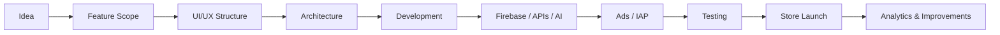

<div align="center">

# 👋 Muhammad Ahsan Shaaf

### Senior Android & iOS Developer • Mobile App Architect • Founder @ Intuitex AI Solutions

**I build production-ready Android & iOS apps for startups, founders, businesses, and product teams.**  
**Kotlin • Jetpack Compose • Swift • SwiftUI • Firebase • AI Apps • AdMob • IAP • Store Launch**

<p align="center">
  <a href="mailto:ahsanshaaf@gmail.com"></a>
  <a href="https://www.linkedin.com/in/iamahsanshaaf/"></a>
  <a href="https://x.com/iamAhsanShaaf"></a>
  <a href="https://github.com/iamahsanshaaf"></a>
</p>

<p align="center">
  
  
  
  
  
</p>

</div>

---

## 🚀 About Me

I am a **Senior Android & iOS Developer** focused on building real-world mobile products with clean architecture, polished UI, monetization, analytics, and store-ready quality.

I have developed and contributed to mobile apps reaching **10M+ installs on Google Play**, including large-scale utility, AI keyboard, translator, scanner, productivity, and monetized apps. Across company, client, and portfolio work, my mobile development experience is connected with apps used by **millions of users globally**.

> I do not just build screens. I build mobile products ready for real users, real growth, and real business outcomes.

---

## 🧭 Quick Navigation

| Section | What You’ll Find |
|---|---|
| [Impact](#-experience--impact) | Scale, production, monetization, and store launch experience |
| [Services](#-services-i-offer) | Android, iOS, AI apps, monetization, redesign, store launch |
| [iOS Portfolios](#-ios-app-portfolios-managed) | App Store developer accounts and app categories I manage/work across |
| [High-Scale Android](#-high-scale-android-experience) | Translator, AI keyboard, utility and monetized Android work |
| [Tech Stack](#-tech-stack) | Kotlin, Compose, Swift, SwiftUI, Firebase, AI, AdMob, StoreKit |
| [Architecture](#-architecture--engineering-style) | Android and iOS project structure examples |
| [Contact](#-contact) | Email, LinkedIn, GitHub, X |

---

## 📊 Experience & Impact

<table>
<tr>
<td width="50%">

### 📱 Mobile Scale
- Developed/contributed to apps reaching **10M+ installs**
- Worked on Android apps used by millions globally
- Managed/worked across multiple iOS app portfolios
- Built apps for utilities, AI, maps, scanners, productivity, and lifestyle categories

</td>
<td width="50%">

### 💰 Product & Monetization
- AdMob native, interstitial, app open, rewarded ads
- StoreKit subscriptions and in-app purchases
- Paywalls and premium flows
- Firebase Remote Config-based monetization control
- Analytics and crash tracking setup

</td>
</tr>
<tr>
<td width="50%">

### 🧠 Engineering Quality
- Clean Architecture
- MVVM / MVI
- Modular code structure
- Reusable UI components
- State management
- Store-compliant UX

</td>
<td width="50%">

### 🚀 Launch Readiness
- App Store Connect setup
- Google Play Console release support
- App metadata and ASO-ready positioning
- Privacy/compliance preparation
- Production testing and release polish

</td>
</tr>
</table>

---

## 💼 Services I Offer

| Service | What I Deliver |
|---|---|
| **Android App Development** | Kotlin, Jetpack Compose, Firebase, APIs, Room, Hilt, AdMob, Play Store launch |
| **iOS App Development** | Swift, SwiftUI, SwiftData/CoreData, StoreKit, Firebase, App Store deployment |
| **AI Mobile Apps** | OpenAI/Gemini integrations, AI writing, AI chat, AI assistants, OCR, smart tools |
| **Monetization Setup** | AdMob, IAP, subscriptions, paywalls, Remote Config, analytics events |
| **App Redesign** | Modern UI, better UX, clean architecture, performance cleanup, store-ready polish |
| **Store Launch Support** | App Store / Play Store preparation, metadata direction, screenshots direction, release setup |

---

## 🍎 iOS App Portfolios Managed

I manage and work across multiple iOS app portfolios, including utility, scanner, maps, AI, lifestyle, GPS, and productivity apps.

### 1. Ikhlaq Ahmed — App Store Portfolio

<a href="https://apps.apple.com/id/developer/ikhlaq-ahmed/id1777750146"></a>

| App Category | Example Apps / Focus Areas |
|---|---|
| Gold & Metal Utility | Gold Scanner & Age Estimator, Metal Detector & Gold Scanner, Gold Detector & Gold Scanner |
| Maps & GPS | Live Earth Map & Satellite, Satellite Finder & Street View, GPS Camera Map & Geotag |
| Document / Tools | Signature Maker, Stamp Maker, Image Search, Photo Recovery, Face Warp |

**Work Focus:** SwiftUI screens, utility app workflows, sensor-based features, map/GPS flows, monetization structure, App Store launch support.

---

### 2. Shahida Parveen — App Store Portfolio

<a href="https://apps.apple.com/id/developer/shahida-parveen/id1851386391"></a>

| App Category | Example Apps / Focus Areas |
|---|---|
| Lifestyle | Pregnancy Tracker Journal |
| Maps / GPS / Navigation | Live Earth Map & Navigation, Satellite Finder - GPS Tracker |
| Utility / Scanner | Object Detector & DocScan, Draw Floor Plans, Stamp Maker, Gold Detector, Metal Detector |

**Work Focus:** SwiftUI app development, GPS/location experiences, OCR/object detection style flows, local content apps, utility UX, StoreKit and deployment support.

---

### 3. Muhammad Ahsan Shaaf — App Store Portfolio

<a href="https://apps.apple.com/id/developer/muhammad-ahsan-shaaf/id1844917800"></a>

| App | Focus Areas |
|---|---|
| **Gramlyse: AI Writer & Essay** | AI writing tools, grammar workflows, essay support, SwiftUI interface, StoreKit subscriptions, productivity UX |

---

## 🤖 High-Scale Android Experience

I have worked on and contributed to large-scale Android apps, including apps that reached **10M+ installs on Google Play**.

> Some high-scale Android apps were developed for companies and clients. Detailed proof, Play Console screenshots, app links, and role details can be shared privately when required.

### Selected Areas

| Area | Work Focus |
|---|---|
| **Speak & Translate / Voice Translator Apps** | Real-time translation flows, language UX, voice input/output, offline-friendly structure, analytics, crash tracking, ads monetization |
| **AI Keyboard / AI Assistant Apps** | AI chat, prompt workflows, writing tools, keyboard UX, API integration, monetization, Remote Config |
| **Utility & Productivity Apps** | Scanner tools, document utilities, camera tools, maps, compass, navigation, monetized app experiences |
| **Monetized Android Products** | AdMob native ads, interstitials, app open ads, rewarded ads, Firebase analytics, release optimization |

---

## 🧠 Core Expertise

<details open>
<summary><b>📱 Android Development</b></summary>

- Kotlin, Java
- Jetpack Compose, XML, ViewBinding
- MVVM, MVI, Clean Architecture
- Room, SQLite, DataStore
- Retrofit, Ktor, OkHttp
- Coroutines, Flow, StateFlow
- Hilt, Dagger
- WorkManager
- Firebase, AdMob, Remote Config
- Google Play Console deployment

</details>

<details open>
<summary><b>🍎 iOS Development</b></summary>

- Swift, SwiftUI, UIKit when required
- MVVM, MVI, modular architecture
- SwiftData, CoreData
- StoreKit, subscriptions, in-app purchases
- Apple Vision / OCR
- Combine, Async/Await
- URLSession
- App Store Connect deployment

</details>

<details open>
<summary><b>🤖 AI App Development</b></summary>

- OpenAI API integration
- Gemini API integration
- AI writing tools
- AI chat apps
- AI dictionary tools
- Prompt-based mobile workflows
- AI-powered productivity tools
- OCR and scanner-style AI features
- API cost-conscious mobile architecture

</details>

<details open>
<summary><b>🔥 Firebase & Monetization</b></summary>

- Firebase Auth, Firestore, Realtime Database, Storage
- Firebase Analytics, Crashlytics, Remote Config, FCM
- AdMob native, interstitial, app open, rewarded ads
- StoreKit subscriptions and IAP
- Paywalls and premium flows
- Remote Config-based ad and paywall control

</details>

---

## 🛠️ Tech Stack

<div align="center">

| Mobile | Backend / Cloud | AI | Monetization | Architecture |
|---|---|---|---|---|
| Kotlin | Firebase | OpenAI | AdMob | Clean Architecture |
| Jetpack Compose | Firestore | Gemini | StoreKit | MVVM |
| Swift | REST APIs | OCR | IAP | MVI |
| SwiftUI | Remote Config | AI Chat | Subscriptions | Modular UI |

</div>

<p align="center">
  
  
  
  
  
  
  
  
</p>

---

## 🏗️ Architecture & Engineering Style

### Android Structure

```text
app/
 ├── data/
 │   ├── local/
 │   ├── remote/
 │   ├── repository/
 │   └── mapper/
 ├── domain/
 │   ├── model/
 │   ├── repository/
 │   └── usecase/
 ├── presentation/
 │   ├── screen/
 │   ├── component/
 │   ├── state/
 │   └── viewmodel/
 └── core/
     ├── designsystem/
     ├── navigation/
     ├── analytics/
     ├── ads/
     ├── billing/
     └── utils/
```

### iOS Structure

```text
App/
 ├── Core/
 │   ├── Theme/
 │   ├── Navigation/
 │   ├── Analytics/
 │   ├── Ads/
 │   ├── Purchases/
 │   └── Utilities/
 ├── Data/
 │   ├── Local/
 │   ├── Remote/
 │   └── Repository/
 ├── Domain/
 │   ├── Models/
 │   ├── UseCases/
 │   └── Contracts/
 └── Presentation/
     ├── Screens/
     ├── Components/
     ├── ViewModels/
     └── State/
```

---

## 📌 App Categories I Have Worked On

<table>
<tr>
<td>AI writing apps</td>
<td>AI keyboard apps</td>
<td>Translator apps</td>
</tr>
<tr>
<td>Scanner / OCR apps</td>
<td>Gold / metal detector apps</td>
<td>GPS / map apps</td>
</tr>
<tr>
<td>Pregnancy / lifestyle apps</td>
<td>Signature / stamp apps</td>
<td>Photo recovery apps</td>
</tr>
<tr>
<td>Object detection apps</td>
<td>Floor plan tools</td>
<td>AdMob / IAP apps</td>
</tr>
</table>

---

## 🧭 My Development Workflow



---

## 🔥 Featured Mobile Work

### Gramlyse: AI Writer & Essay

<a href="https://apps.apple.com/id/developer/muhammad-ahsan-shaaf/id1844917800"></a>

AI writing and grammar-focused productivity app built around writing improvement, essay support, grammar checking, and AI-powered text workflows.

**Focus areas:** SwiftUI, AI writing flows, grammar workflows, StoreKit subscriptions, App Store-ready UX.

---

### Gold Scanner & Detector Utility Apps

<a href="https://apps.apple.com/id/developer/ikhlaq-ahmed/id1777750146"></a>

Utility-focused iOS apps around scanner flows, metal detector tools, gold scanner concepts, compass/level features, and utility app experiences.

**Focus areas:** SwiftUI screens, sensor-based UI, utility workflows, monetization-ready structure, App Store deployment support.

---

### Live Earth Map, GPS & Satellite Apps

<a href="https://apps.apple.com/id/developer/ikhlaq-ahmed/id1777750146"></a>
<a href="https://apps.apple.com/id/developer/shahida-parveen/id1851386391"></a>

Navigation and map-focused utility apps involving GPS, satellite finder, live earth map, street view, weather, route planning, and compass flows.

**Focus areas:** Map-based UI, location workflows, GPS features, utility navigation, monetization and store packaging.

---

## 📂 Recommended Public Repositories

I am organizing my GitHub around clean, reusable, portfolio-ready repositories.

| Repository Idea | Purpose |
|---|---|
| `jetpack-compose-mvi-starter` | Modern Android starter with MVI, Compose, Hilt, Navigation |
| `swiftui-mvi-starter` | SwiftUI architecture starter with clean state handling |
| `firebase-mobile-template` | Firebase Auth, Firestore, Analytics, Crashlytics demo |
| `ai-chat-mobile-demo` | AI chat workflow using OpenAI/Gemini APIs |
| `admob-iap-template` | Ads + subscriptions/IAP production-style setup |
| `mobile-design-system` | Reusable SwiftUI/Compose UI components |

---

## 🌍 Availability

I am open to:

- Freelance mobile app projects
- Android app development
- iOS app development
- AI mobile app development
- Startup MVPs
- App redesign projects
- App monetization setup
- Firebase and API integration
- App Store / Play Store launch support
- Long-term remote collaboration

---

## 📫 Contact

<p align="left">
<a href="mailto:ahsanshaaf@gmail.com"></a>
<a href="https://www.linkedin.com/in/iamahsanshaaf/"></a>
<a href="https://x.com/iamAhsanShaaf"></a>
</p>

**Location:** Pakistan 🇵🇰  
**Availability:** Open to remote freelance, contract, and long-term mobile app projects  
**Focus:** Android • iOS • AI Apps • Firebase • Monetization • Store Launch

---

<div align="center">

### ⭐ From idea to UI, development, monetization, and store launch.

**I build mobile apps ready for real users.**

</div>

