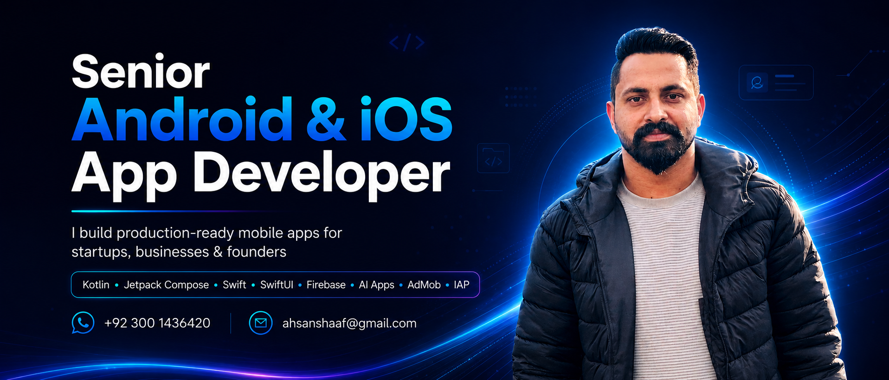
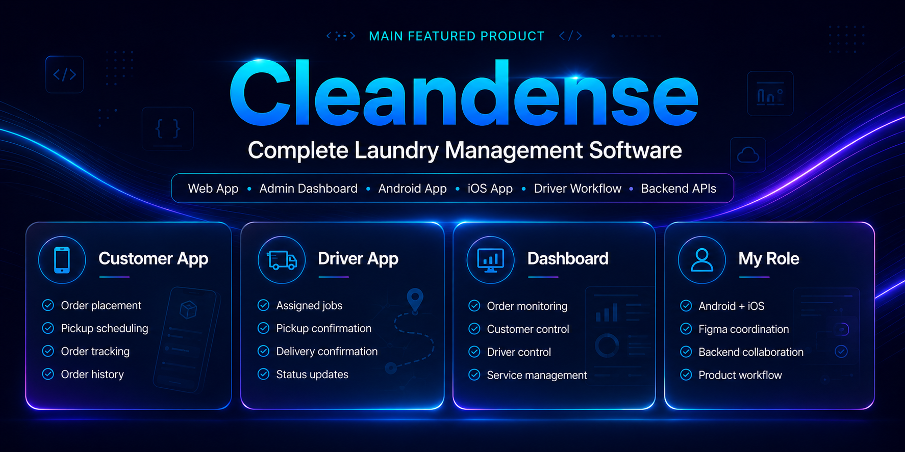
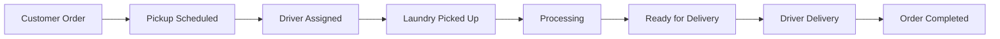
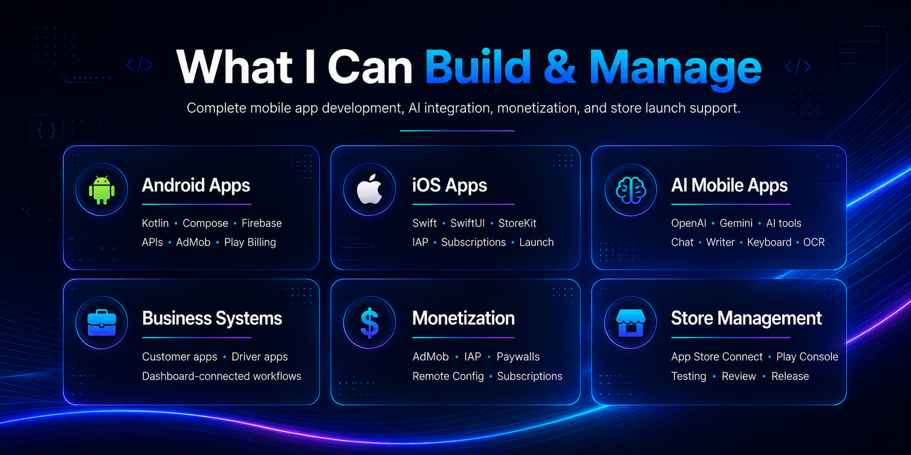
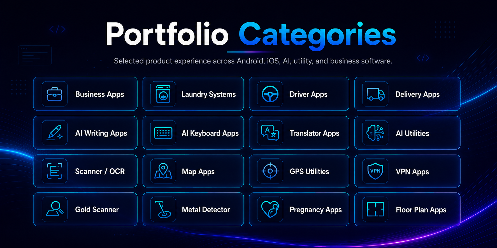
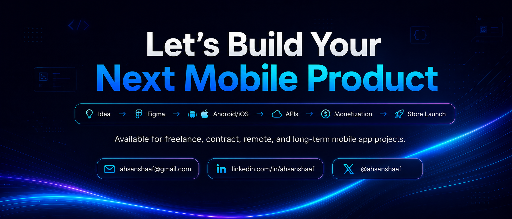

 

 
 

 
 

### I help startups, businesses, and app publishers build production-ready Android & iOS apps — from idea to store launch.

**Native Android · Native iOS · AI Apps · Firebase · AdMob · IAP · Subscriptions · App Store / Play Store Management**

---

<table>
<tr>
<td width="55%" valign="top">

## 🚀 Client-Focused Summary

I am **Muhammad Ahsan Shaaf**, a **Senior Android & iOS Developer** and founder of **Intuitex AI Solutions**.

I help clients turn app ideas into real mobile products by handling the complete development cycle: planning, UI collaboration, native Android/iOS development, API integration, Firebase, monetization, testing, deployment, and post-launch improvements.

My work is best suited for:

- Startups building a new mobile product
- Businesses that need a custom app system
- App publishers who need monetized Android/iOS apps
- Founders who need a developer who understands launch, ads, IAP, and store management
- Existing app owners who need redesign, bug fixing, optimization, or new features

</td>
<td width="45%" valign="top">

## 🎯 Professional Tagline

**I build mobile apps that are not only beautiful, but also launch-ready, monetization-ready, and built for real users.**

What I bring to a project:

- Product thinking
- Clean native development
- Modern UI implementation
- Backend/API coordination
- Firebase and analytics setup
- AdMob and subscription monetization
- App Store and Play Store release support
- Long-term app improvement mindset

</td>
</tr>
</table>

---

## 💎 What Clients Hire Me For

| Need | What I Deliver |
|---|---|
| **A new app idea** | Full Android/iOS app development from concept to launch |
| **A business app system** | Customer app, driver app, admin/dashboard-connected workflows |
| **A monetized app** | AdMob, IAP, subscriptions, paywalls, analytics, and Remote Config |
| **An AI-powered app** | AI writer, AI chat, AI keyboard, AI tools, OpenAI/Gemini integrations |
| **An existing app upgrade** | UI redesign, bug fixing, refactoring, performance cleanup, new features |
| **Store launch support** | Google Play Console, App Store Connect, testing, release, updates |

---

## 🧼 Featured Product Case Study: Cleandense

**Cleandense** is a complete laundry management software ecosystem built for real business operations. It manages the full laundry workflow from customer order placement to pickup, processing, delivery, driver operations, and admin control.

This project shows my ability to work beyond simple app screens. Cleandense includes customer-facing mobile apps, driver-side workflows, web/dashboard management, backend API collaboration, and product-level feature coordination.

<table>
<tr>
<td width="25%" align="center"><b>Customer App</b> Order placement Service selection Pickup scheduling Order tracking Order history</td>
<td width="25%" align="center"><b>Driver App</b> Assigned jobs Pickup confirmation Delivery confirmation Status updates Operational flow</td>
<td width="25%" align="center"><b>Admin Dashboard</b> Order monitoring Customer control Driver control Service management Business overview</td>
<td width="25%" align="center"><b>Backend APIs</b> Order lifecycle User data flow Driver flow Status updates Business rules</td>
</tr>
</table>

### My Role in Cleandense

| Area | Contribution |
|---|---|
| **Product Workflow** | Converted laundry business operations into clear mobile user journeys |
| **Android Development** | Developed and managed Android customer and workflow features |
| **iOS Development** | Developed and managed iOS customer and workflow features |
| **Driver Flow** | Worked on Uber/Careem-style pickup and delivery job workflows |
| **UI/UX Collaboration** | Coordinated with UI/UX team for Figma design implementation |
| **Backend Collaboration** | Coordinated with backend developer for APIs, data flow, and feature behavior |
| **Testing & Improvements** | Tested core flows, fixed bugs, improved usability, and refined product quality |

---

## 🛠️ Services

<b>📱 Native Android App Development</b>

I build modern Android apps using **Kotlin, Jetpack Compose, Firebase, APIs, AdMob, Play Billing, and Google Play Console**.

Best for:

- Business apps
- Utility apps
- AI apps
- API-based apps
- Monetized apps
- Existing app redesigns
- Play Store-ready products

<b>🍎 Native iOS App Development</b>

I build iOS apps using **Swift, SwiftUI, StoreKit, Firebase, APIs, subscriptions, and App Store Connect**.

Best for:

- Startup apps
- Subscription apps
- AI tools
- Productivity apps
- Utility apps
- Premium SwiftUI apps
- App Store-ready products

<b>🧩 Complete Business App Systems</b>

I can help build complete app ecosystems, not only one standalone screen.

Examples:

- Customer apps
- Driver apps
- Admin/dashboard-connected workflows
- Service booking apps
- Delivery apps
- Laundry/service management systems
- Backend API-connected mobile products

<b>🤖 AI Mobile App Development</b>

I build AI-powered mobile apps with clean user flows and practical API integration.

Examples:

- AI writer apps
- AI chat apps
- AI keyboard apps
- AI dictionary tools
- AI homework tools
- AI scanner/assistant features
- OpenAI and Gemini-powered workflows

<b>💰 Monetization & Store Management</b>

I can prepare apps for real business use with monetization and release setup.

Includes:

- AdMob native, interstitial, app open, and rewarded ads
- In-app purchases
- Auto-renewable subscriptions
- Paywalls
- Firebase Remote Config
- Analytics and crash tracking
- App Store Connect and Play Console release support

---

## 📊 Experience Snapshot

| Area | Experience |
|---|---|
| **Complete Product Systems** | Cleandense laundry software with web, dashboard, Android, iOS, and driver workflow |
| **High-Scale Android Apps** | Developed and contributed to apps reaching **10M+ installs** |
| **iOS Portfolio** | Selected App Store apps across AI, utility, maps, scanner, lifestyle, and productivity |
| **Monetization** | AdMob, IAP, subscriptions, paywalls, Remote Config |
| **Store Deployment** | Google Play Console and App Store Connect |
| **AI Apps** | AI writer, AI keyboard, AI dictionary, AI assistant, AI utilities |
| **Business Apps** | Laundry systems, dashboard-connected apps, driver workflows, service apps |
| **Custom Apps** | Standalone apps, API apps, AI apps, utility apps, productivity apps |

---

## 🤖 Android App Portfolio & Google Play Experience

Selected Android work and contribution experience across AI, translation, productivity, camera, utility, VPN, creative tools, and business app categories.

| Product | Link | Client-Relevant Strength |
|---|---|---|
| **Speak & Translate / Voice Translator** | [Google Play](https://play.google.com/store/apps/details?id=com.speaktranslate.englishalllanguaguestranslator.ivoicetranslation) | Voice translation UX, performance, monetization, release support |
| **AI Keyboard / AI Assistant / Art Generator** | [Google Play](https://play.google.com/store/apps/details?id=aichatbot.keyboard.translate.aiask.artgenerator) | AI flows, keyboard UX, API integration, ads, Firebase |
| **AI Photo Enhancer / Unblur Editor** | [Google Play](https://play.google.com/store/apps/details?id=com.dw.aiphotoenhancer.unblur.editor) | Photo utility UX, AI-style editing flows, monetization |
| **AI Homework Solver** | [Google Play](https://play.google.com/store/apps/details?id=com.aiassistant.homeworksolver) | AI assistant flows, study tools, API-based experiences |
| **AR Drawing / AR Sketch / Trace Anime** | [Google Play](https://play.google.com/store/apps/details?id=com.ardrawing.arsketch.paint.traceanime) | Camera utility, drawing workflows, creative app UX |
| **VPN App** | [Google Play](https://play.google.com/store/apps/details?id=com.joltapps.vpn) | Utility app UX, subscription/monetization, release support |

> Some high-scale Android apps were built for companies and clients. Detailed proof, Play Console screenshots, and role details can be shared privately when required.

---

## 🍎 Selected iOS App Portfolio

Curated iOS portfolio highlights across AI, utilities, maps, scanner/OCR, lifestyle, construction, and productivity categories.

| Featured iOS App | App Store Link | Client-Relevant Strength |
|---|---|---|
| **Gramlyse: AI Writer & Essay** | [View App](https://apps.apple.com/us/app/gramlyse-ai-writer-essay/id6753770520) | AI writing, grammar tools, essay workflows, subscriptions, productivity UX |
| **Gold Scanner & Age Estimator** | [View App](https://apps.apple.com/id/app/gold-scanner-age-estimator/id6768601764) | Sensor-based utility, AI-style scan flow, premium subscription model |
| **Live Earth Map & Satellite** | [View App](https://apps.apple.com/id/app/live-earth-map-satellite/id6761748624) | Maps, traffic, weather, route planning, location-based utility UX |
| **Pregnancy Tracker Journal** | [View App](https://apps.apple.com/id/app/pregnancy-tracker-journal/id6777887741) | Lifestyle tracking, local content, weekly guidance, clean SwiftUI flows |
| **Object Detector & DocScan** | [View App](https://apps.apple.com/id/app/object-detector-docscan/id6759646285) | Object detection, OCR-style scanning, document utility experience |
| **Draw Floor Plans** | [View App](https://apps.apple.com/id/app/draw-floor-plans/id6755029386) | Construction utility, floor plan tools, template-based workflow |
| **Signature Maker - Scan Sign** | [View App](https://apps.apple.com/id/app/signature-maker-scan-sign/id6759244726) | E-signature, PDF utility, scan/sign workflow, productivity tool |

---

## ⚙️ Tech Stack

<table>
<tr>
<td width="50%" valign="top">

### Mobile Development

</td>
<td width="50%" valign="top">

### Product Infrastructure

</td>
</tr>
</table>

---

---

## 🔄 How I Deliver a Mobile Product

```mermaid
flowchart LR
    A[Business Goal] --> B[Feature Scope]
    B --> C[Figma / UI Collaboration]
    C --> D[Android / iOS Development]
    D --> E[API Integration]
    E --> F[Firebase / Analytics]
    F --> G[Ads / IAP / Subscriptions]
    G --> H[Testing & QA]
    H --> I[Store Preparation]
    I --> J[App Review & Launch]
    J --> K[Post-Launch Improvements]
```

---

## ✅ Production Quality Checklist

<table>
<tr>
<td width="50%">

- Clean and maintainable code
- Reusable UI components
- Scalable app structure
- Smooth onboarding
- Loading, empty, and error states
- Proper state management

</td>
<td width="50%">

- Firebase Analytics and Crashlytics
- AdMob and IAP safety
- Store-compliant permission usage
- App Store / Play Store readiness
- Post-launch monitoring
- Long-term improvement support

</td>
</tr>
</table>

---

## 📂 Recommended Public Repositories

| Repository Idea | What It Proves |
|---|---|
| **Jetpack Compose MVI Starter** | Android clean architecture and production-style state management |
| **SwiftUI MVI Starter** | iOS architecture, SwiftUI structure, and scalable app flow |
| **Firebase Auth + Firestore Demo** | Backend integration and user data flow |
| **AI Chat Mobile Demo** | AI API integration and prompt-based mobile workflows |
| **AdMob + IAP Monetization Demo** | Ads, billing, paywall, and monetization setup |
| **SwiftUI Paywall Template** | StoreKit subscriptions and premium app flow |
| **Mobile Design System Components** | Reusable UI components for Android/iOS apps |

---

## 📈 GitHub Activity

> If stats images ever fail to load, the portfolio still remains readable because the main design uses local image assets inside the repository.

---

 

 
 

**Email:** ahsanshaaf@gmail.com  
**Location:** Pakistan  
**Availability:** Remote freelance, contract, and long-term mobile app projects

